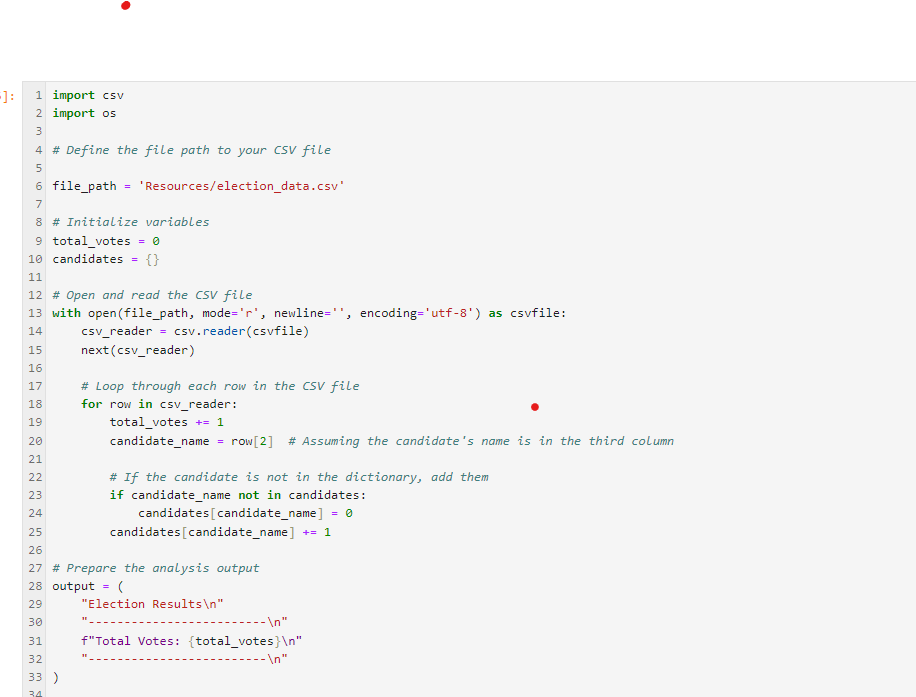

# python-challenge_new

## Lists

1. Item 1

I encountered two bugs that took me a longer time to solve. The first one is that I don't know how to print the result to a txt file. So I asked ChatGPT and found the clue. Then I tried twice and finally made the txt file print. 

2. Item 2

The second issue that I encountered is the Loop in the PyPoll folder, that I don't know how to write the loop correctly. I tried several times, though forgetting doing the screenshot, it did not work out. 

So it took me quite a while to google the hint. Therefore I added the detail explanation besides the code, therefore I finally understand the way and make it. 

